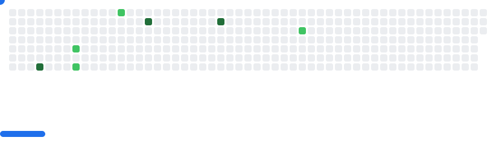

<!-- <h1 align="left">print('Hello, world!')</h1> -->

  

<h3 align="left">Connect with me:</h3>

<picture>
  <source
    media="(prefers-color-scheme: dark)"
    srcset="images/breakout-dark.svg"
  />
  <source
    media="(prefers-color-scheme: light)"
    srcset="images/breakout-light.svg"
  />
  
</picture>

